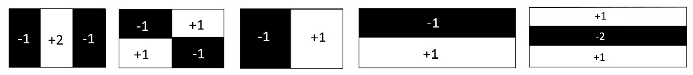
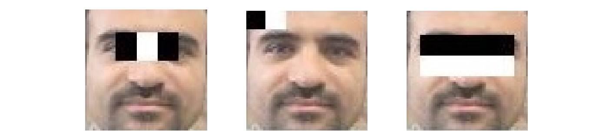
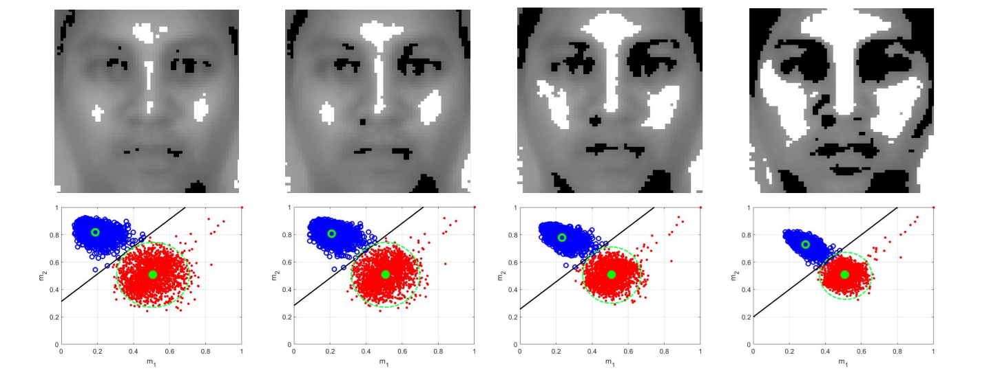
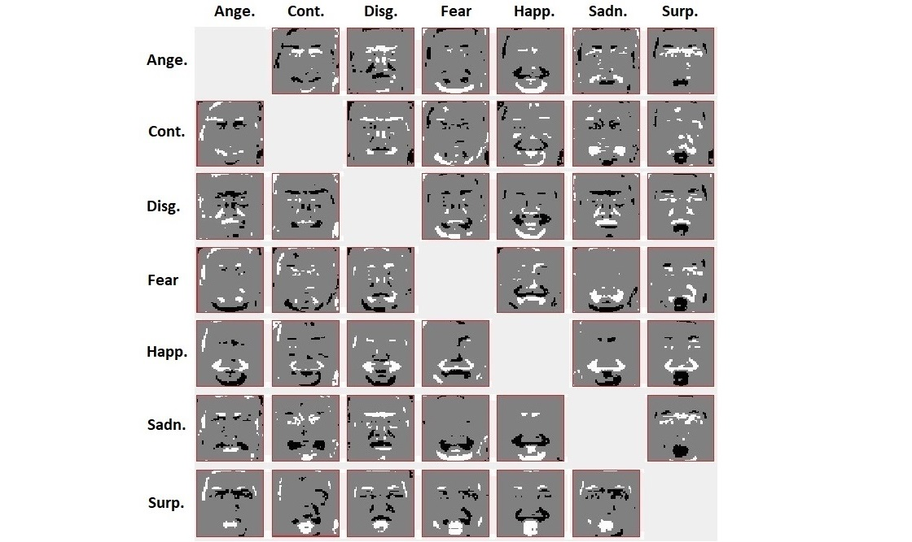
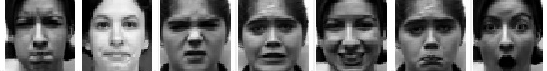
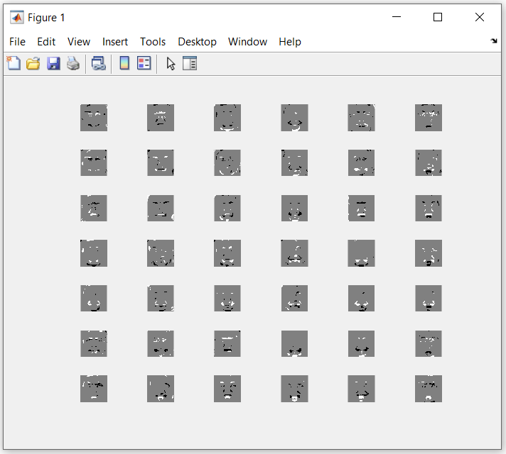
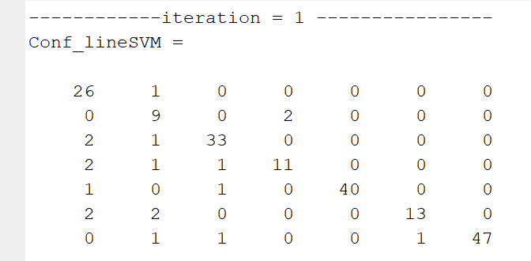
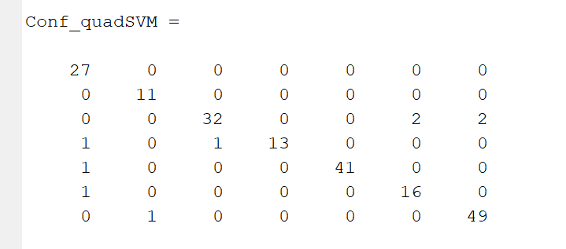
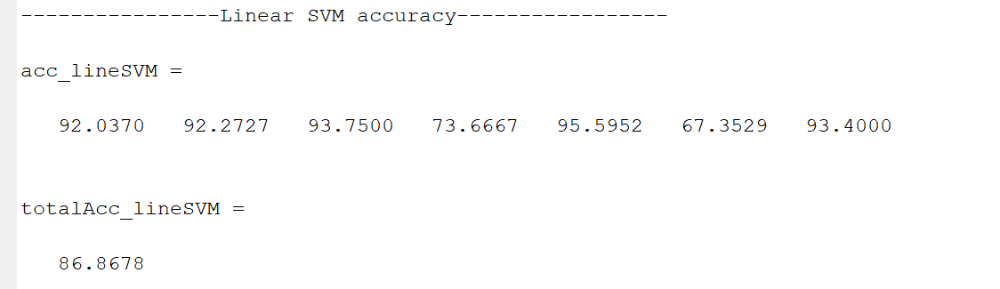
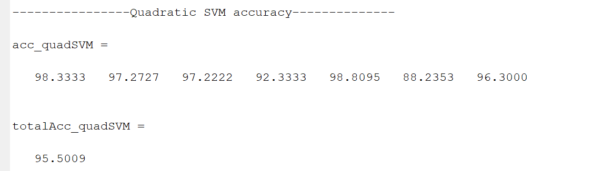

# Project Title: Fully Dispersed Haar-like Filters for Facial Expression Recognition (FER)

## Description
This repository contains the MATLAB code and datasets for implementing the **Fully Dispersed Haar-like Filter** for feature extraction of face images. The goal of this project is to provide a Fully Dispersed Haar-like Filter for feature extraction, as proposed by **Z. Sedaghtjoo, H. Hosseinzadeh, and A. Shirzadi**. 

Haar-like filters are renowned for their simplicity, speed, and accuracy in various computer vision tasks.
Haar-like features are local texture descriptors that quantify differences in the average intensity values between adjacent rectangular regions. The following figure illustrates several simple Haar-like filters that
are commonly employed in feature extraction applications. 



As illustrated in above figure, Haar-like filters are commonly represented as combinations of two or more rectangular regions composed of black and white pixels. 
This figure showcases various examples of Haar-like filters, with the default weights clearly indicated on their respective rectangles. These filters can be applied for facial feature extraction as is shown in the next figure:



The feature value g for a Haar-like filter is defined as follows:

*g(x) = v1 m1(x) + v2 m2(x),* 

where x is an image, and m1 and m2 denote the mean intensities of the pixels within the black and white regions of the filter, respectively. The weights v1 and v2 correspond to these regions and are typically represented as two integers whose sum equals zero.
Numerous algorithms are available for determining the optimal values of weights. This code focuses specifically on identifying optimal Haar-like filters characterized by equal black and white regions. Then, the weights are assigned as v1 = −1 and v2 = 1.

We introduce novel filters as extreme cases of the Haar-like filters, named **fully dispersed Haar-like filters**. A distinctive feature of these new filters is their adaptability, allowing pixels to reposition themselves dynamically to optimize the detection of local features. These filters mark a significant advancement within the Haar-like framework, merging ease of use with improved accuracy in feature detection. To mitigate the risk of overfitting, an optimization algorithm is developed by the authors that facilitates the creation of locally
optimized dispersed Haar-like filters, specifically targeting regions of the face to enhance detection precision. The approach is not limited to face detection; it also extends to facial expression recognition across seven distinct classes. The experimental results demonstrate the superior performance of the newly optimized Haar-like filters, affirming their effectiveness in practical applications.

Then a novel code is proposed in [1] to identify optimal fully dispersed Haar-like filters for enhanced facial feature extraction and recognition. Unlike traditional Haar-like filters, these novel filters allow pixels to move freely within images, enabling more effective capture of intricate local features. Through extensive experiments on face detection, the optimized filters can distinguish between face images and clutter with minimal error. The following image displays the optimal Haar-like filters for face feature extraction, illustrating the variation in *filter size* from small to large. 



The face and clutter images are distingushed linearly by the use of the fully dispersed Haar-like filters as is shown in the second row of the above figure. Each column of this figure can be one of the outputs generated by the code presented in [1]. These filters achieve high accuracy, exceeding 98%, as demonstrated in the results of the code.

These filters are extracted for the facial experession recognaition with distinct emotional classes. Experiment results show the Haar-like features lead 86% and 94% accuracy when the linear and quadratic SVM are applied for facial experession recognaition, respectively. The code respect to the classification is presented here. The Haar-like features respect to the FER may be presented as the follow when the filter is optimized for the dataset presented in the code.




[1] https://github.com/Sedaghatjoo/fully-dispersed-Haar-like-filter-FD

## Contents
- **MATLAB Code**: The main algorithm implemented in MATLAB for facial expression recognition. 
- **Dataset**: A data file containing some face images used in this project.
  - `pics.mat`: Contains some human faces for training and testing.

Some facial images applied in this research are shown in the next figure.



The images are categorized into seven distinct emotional classes: anger (135 images), contempt (54 images), disgust (177 images), fear (75 images), happiness (207 images), sadness (84 images), and surprise (249 images). 
The two-dimensional images are resized to 64 × 64 and converted into one dimensional vectors by arranging the pixels contained in the images. In this situation, an image of size 64 × 64 is transformed to a row vector of length 4096 and inserted in a dataset as a row.

## Installation
1. Clone this repository to your local machine:
   ```bash
   git clone https://github.com/Sedaghatjoo/fully-dispersed-Haar-like-filter-FER.git

   ```

2. Ensure you have MATLAB installed to run the code. The required version is **MATLAB R2020b** or newer.

## Usage
1. Open the MATLAB script **Fully_Dispered_HaarLike.m**.
2. Load the dataset files by running:
   ```matlab
   load('Pics.mat');
   ```
   "Pics" matrix is data matrix of face images.  Some face images of size 48×48 are vectorized and inserted in the matrix. The images are categorized into seven distinct emotional classes: anger (135 images), contempt (54 images), disgust (177 images), fear (75 images), happiness (207 images), sadness (84 images), and surprise (249 images). 
   One can replace his data matrix instead of the matrix .
   ... In this situation parameter s_pic which shows the size if studied images (48 × 48) has to be updated. The same statements are also valid for clutter matrix "Clutter2". 

4. Run the script to start feature Extraction process.
   
   Before running the code, you can change the following paramers:
   div=0.8 (The ratio of training to testing samples ),
   num1=64 (the number of black pixels of the filter),
   num2=64 (the number of white pixels of the filter) ,
   Wh=[-1,1] (the weights of black and white parts of the filter),
   itter=200 (the number of iterations for training the filter).
   
6. View the results in the MATLAB workspace.
   
   The results include a graph contains optimized **fully dispersed Haar-like filter** for feature extraction, similar to the following picture:
   


Next, linear and quadratic SVMs are utilized for classification. 
The confusion matrix, which includes the number of misclassified samples, is presented below for each iteration:




for linear and quadratic SVM, respectively. The code will be run 20 times, and the mean accuracy of the classification will be presented as follows:





for linear and quadratic SVM, respectively. One can see the accuracy of the classification is totally upper than 95% when quadratic SVM is applied.

## Contribution Guidelines
We welcome contributions to improve the algorithm, code, or documentation. If you'd like to contribute, please:
1. Fork the repository.
2. Create a new branch for your feature or fix.
3. Make your changes and test them.
4. Create a pull request with a detailed description of your changes.


## Citation
If you use this code or dataset in your research, please cite this repository in your work:
```
Sedaghatjoo, S. (2024). Fully Dispersed Haar-like Filter for Facial Expression Recognishion. GitHub Repository. https://github.com/Sedaghatjoo/fully-dispersed-Haar-like-filter-FER
```

## Links
- **Dataset**: 
[Pics.mat](https://github.com/Sedaghatjoo/fully-dispersed-Haar-like-filter-FER/blob/master/Pics.mat)
- **GitHub Repository**: [https://github.com/Sedaghatjoo/fully-dispersed-Haar-like-filter-FER](https://github.com/Sedaghatjoo/fully-dispersed-Haar-like-filter-FER)


